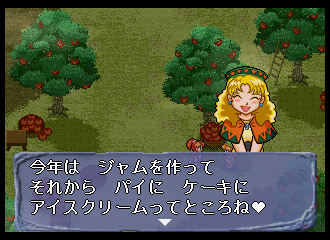

# Text

Text is located in the numbered S*.FLD files; I'm not yet sure if they contain anything other than text.

The game's font is located in [../files/KANJI.FNT](KANJI.FNT). Text uses Shift JIS, which is a variable-width encoding; all text I've observed so far is from the two-byte range, except for control codes such as newlines. All of the characters I've observed so far follow their Shift JIS codepoints except "❤︎", represented at 9E42. In Shift JIS, this would be "曖".

## Sample

This is the first dialogue box in the game.



> 今年は ジャムを作って<br>
> それから パイに ケーキに<br>
> アイスクリームってところね❤<br>

Here's the in-game representation:

```
\x8d\xa1\x94\x4e\x82\xcd\x81\x40\x83\x57\x83\x83\x83\x80\x82\xf0\x8d\xec\x82\xc1\x82\xc4\r\n
\x82\xbb\x82\xea\x82\xa9\x82\xe7\x81\x40\x83\x70\x83\x43\x82\xc9\x81\x40\x83\x50\x81\x5b\x83\x4c\x82\xc9\n
\x83\x41\x83\x43\x83\x58\x83\x4e\x83\x8a\x81\x5b\x83\x80\x82\xc1\x82\xc4\x82\xc6\x82\xb1\x82\xeb\x82\xcb\x9e\x42
```

Or, in JIS codepoints:

```
\x{8da1}\x{944e}\x{82cd}\x{8140}\x{8357}\x{8383}\x{8380}\x{82f0}\x{8dec}\x{82c1}\x{82c4}\r\n
\x{82bb}\x{82ea}\x{82a9}\x{82e7}\x{8140}\x{8370}\x{8343}\x{82c9}\x{8140}\x{8350}\x{815b}\x{834c}\x{82c9}\n
\x{8341}\x{8343}\x{8358}\x{834e}\x{838a}\x{815b}\x{8380}\x{82c1}\x{82c4}\x{82c6}\x{82b1}\x{82eb}\x{82cb}\x{9e42}
```

Line 1:

| Offset | Character | Index in KANJI.FNT | Codepoint in-game |
| ------ | --------- | ------------------ | ----------------- |
| 00 | 今 | 0295 | 8DA1 |
| 01 | 年 |  | 844E |
| 02 | は | 007E | 82CD |
| 03 |   | 0000 | 8140 |
| 04 | ジ | 00AC | 8357 |
| 05 | ャ | 00D7 | 8383 |
| 06 | ム | 00D4 | 8380 |
| 07 | を | 0093 | 82F0 |
| 08 | 作 |  | 8DEC |
| 09 | っ | 0066 | 82C1 |
| 10 | て | 0069 | 82C4 |

Line 2:

| Offset | Character | Index in KANJI.FNT | Codepoint in-game |
| ------ | --------- | ------------------ | ----------------- |
| 00 | そ | 0060 | 82BB |
| 01 | れ | 008F | 82EA |
| 02 | か | 004E | 82A9 |
| 03 | ら | 008C | 82E7 |
| 04 |   | 0000 | 8140 |
| 05 | パ | 00C5 | 8370 |
| 06 | イ | 0098 | 8343 |
| 07 | に | 0062 | 82C9 |
| 08 |   | 0000 | 8140 |
| 09 | ケ | 00A5 | 8350 |
| 10 | ー | 000A | 815B |
| 11 | キ | 00A1 | 834C |
| 12 | に | 0062 | 82C9 |

Line 3:

| Offset | Character | Index in KANJI.FNT | Codepoint in-game |
| ------ | --------- | ------------------ | ----------------- |
| 00 | ア | 0096 | 8341 |
| 01 | イ | 0098 | 8343 |
| 02 | ス | 00AD | 8358 |
| 03 | ク | 00A3 | 834E |
| 04 | リ | 00DE | 838A |
| 05 | ー | 000A | 815B |
| 06 | ム | 00D4 | 8380 |
| 07 | っ | 0066 | 82C1 |
| 08 | て | 0069 | 82C4 |
| 09 | と |      | 82C6 |
| 10 | こ | 0056 | 82B1 |
| 11 | ろ | 0090 | 82EB |
| 12 | ね | 0070 | 82CB |
| 13 | ❤︎ | 030F | 9E42 |

